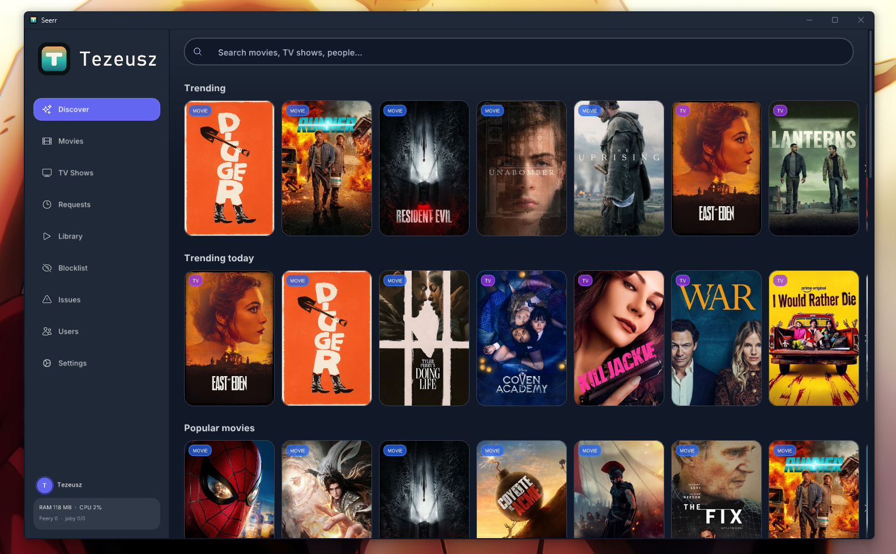
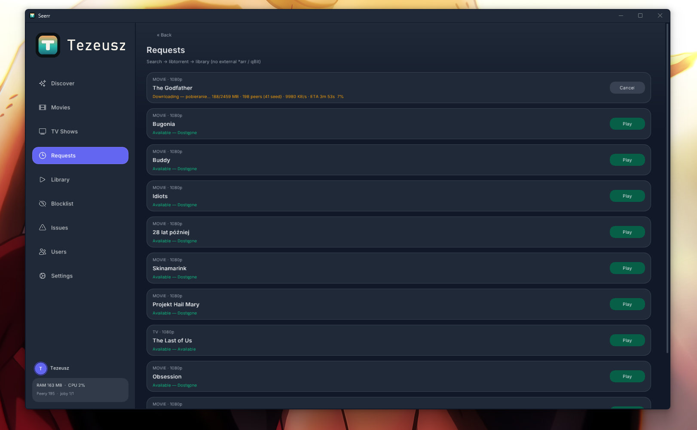
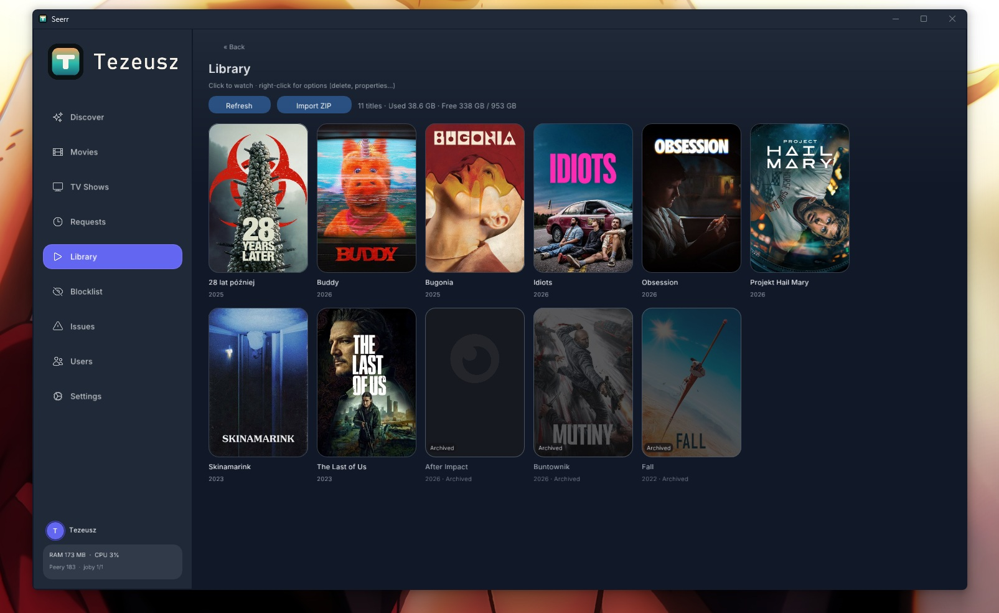
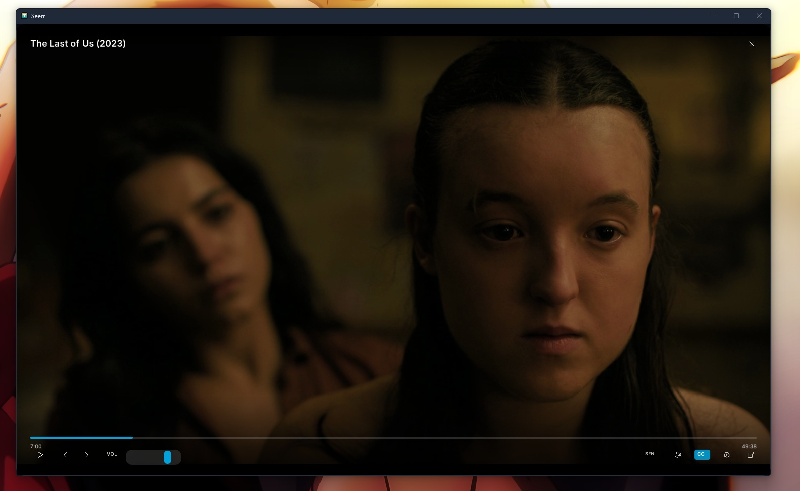
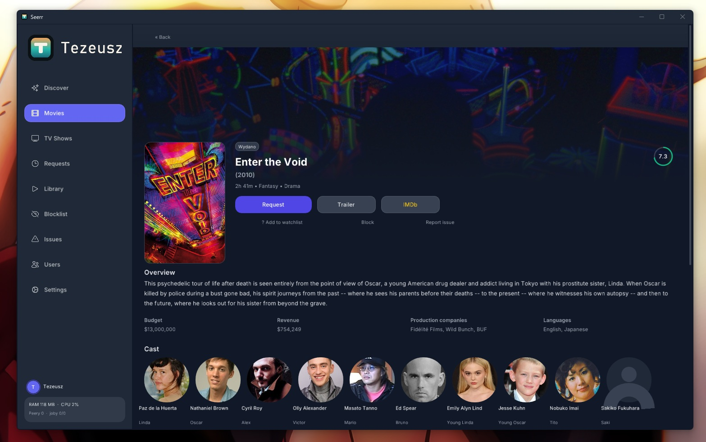

# Tezeusz

A desktop app for discovering, downloading, and watching movies and TV shows - all in one place. No separate download client or media server required.

Inspired by [Seerr](https://github.com/seerr-team/seerr) / Jellyseerr, built as a native Windows & Linux app.

## What you can do

- **Browse & search** - trending, popular, and upcoming titles from TMDB
- **Download** - request a title and Tezeusz finds torrents and downloads them for you
- **Watch in-app** - built-in player (VLC) with progress resume
- **Subtitles** - download and manage subtitles next to your files
- **AI Lector** - offline voice-over from subtitles (optional), overlaid on the original audio
- **Library** - your downloaded titles, export/import between devices
- **Updates** - in-app updates when you use the installer build

Polish and English UI.

## Screenshots

### Discover

### Requests

### Library

### Player

### Title details

## Download

Get the latest build from the [**latest release**](https://github.com/hdmain/tezeusz/releases/latest):

| Platform | What to get |
|----------|-------------|
| **Windows** | `tezeusz-windows-setup.exe` - recommended installer (auto-update works) |
| **Windows** | Portable zip - unpack and run `tezeusz.exe` |
| **Linux** | `.deb` package or portable zip |

### Windows installer

1. Download `tezeusz-windows-setup.exe`
2. Run it (installs for your user under `%LOCALAPPDATA%\Programs\Tezeusz`)
3. Launch **Tezeusz** from the Start menu

### Windows portable

1. Download and unpack the zip
2. Run `tezeusz.exe`
3. Settings and cache stay in `%APPDATA%\Tezeusz`

### Linux

Install the `.deb`, or unpack the portable zip and run the `tezeusz` binary.

Playback needs **VLC** installed on the system (Linux). The Windows packages already include what the player needs.

## First steps

1. Open **Settings** and set your download folder
2. Browse **Discover** or use search
3. Open a title → **Request** / download
4. When it finishes, find it in **Library** and hit **Play**

Optional: enable **AI Lector** in Settings to generate a voice-over from subtitle files (right-click a title in Library).

## Tips

- Prefer the **Windows setup** if you want automatic updates
- Keep enough free disk space in the download folder
- For the best lector overlay (quieter film audio under the narrator), install [ffmpeg](https://ffmpeg.org/) and put it on your PATH (or next to `tezeusz.exe`)

## Contribute / contact

Want to help build Tezeusz or talk about ideas? Reach out:

- Open a [GitHub issue](https://github.com/hdmain/tezeusz/issues)
- Message on [Session](https://getsession.org/):
  `05bdeb20f6e6d20a31ae0e91d38df7089ea89c9fad05b00db471d6d49c7c160b47`

  Or open chat directly: [sessionmessenger://DM?sessionID=05bdeb20f6e6d20a31ae0e91d38df7089ea89c9fad05b00db471d6d49c7c160b47](sessionmessenger://DM?sessionID=05bdeb20f6e6d20a31ae0e91d38df7089ea89c9fad05b00db471d6d49c7c160b47)

## Privacy & legal

Tezeusz uses public metadata (TMDB) and torrent search. You are responsible for complying with copyright and local laws where you live.

## For developers

Source, build scripts, and packaging live in this repository. See `scripts/` and `CMakeLists.txt` if you want to build from source.

## License

UI patterns inspired by [Seerr](https://github.com/seerr-team/seerr). Bundled libraries keep their own licenses (Dear ImGui, libtorrent, VLC, etc.).
